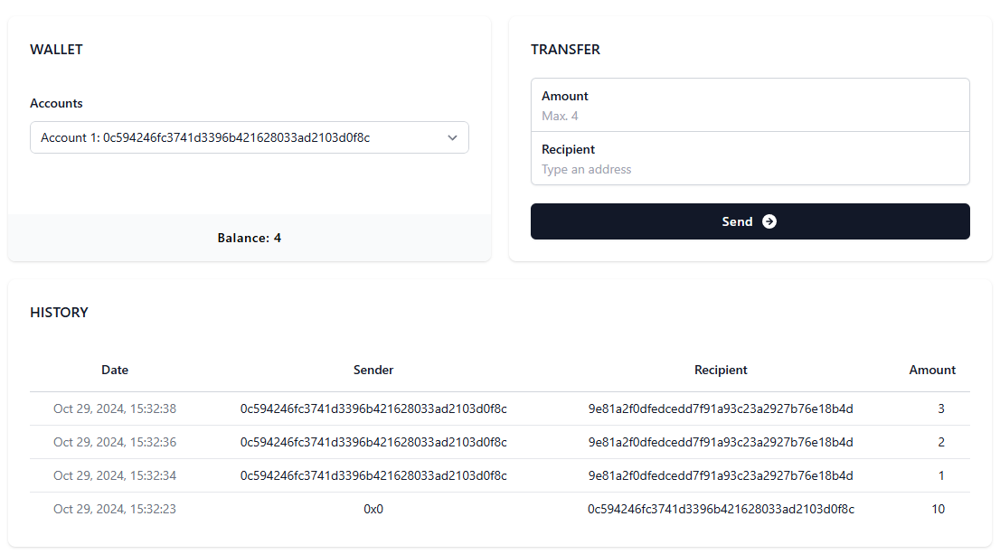

# ECDSA node

React frontend that communicates with a Node.js server responsible for transferring balances between addresses by creating digital signatures with the appropriate private keys and verifying them on the backend.

It uses the [Ethereum Cryptography library](https://github.com/ethereum/js-ethereum-cryptography), specifically the [elliptic curve operations](https://github.com/paulmillr/noble-curves) on the curve secp256k1.



## Usage

#### Client ([React](https://react.dev/), [Vite](https://vite.dev/), [Tailwind CSS](https://tailwindcss.com/))

1. Open the `/client` folder from terminal.
2. Run `npm install` to install all the dependencies.
3. Run `npm run dev` to start the application .
4. Visit the application at http://127.0.0.1:5173/.

#### Server ([Express](https://expressjs.com/))

1. Open the `/server` folder from terminal.
2. Run `npm install` to install all the dependencies.
3. Get private key/address pairs by running `npm run generate` and copy them into `accounts.config.json` using the JSON structure below:

   ```
   {
     "address_1": {
       "label": "Account 1",
       "balance": 10,
       "privateKey": "privateKey_1"
     },
     "address_2": {
       "label": "Account 2",
       "balance": 20,
       "privateKey": "privateKey_2"
     }
   }
   ```

4. Run `npm run dev` to start the server.
